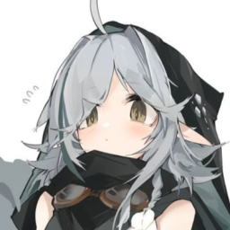

layout: page
title: "About"
permalink: /kokabiel.md

<link rel="stylesheet" href="./fonts/BigBlueTermNerdFont/stylesheet.css"></link>

</img>

<h1 style="color: orange; font-family: 'BigBlueTermPlus Nerd Font Mono'">Kokabiel</h1>

Backend software engineer.

Hi, I am Kokabiel.

A <dww style="color: orange;">backend software engineer</dww> based in <dww style="color: red">New Mexico, US.</dww>

I have mostly developed websites and discord bots, although I am starting to work on a game engine soon.

I also enjoy making circuits in games like <dww style="color: cyan;">Turing Complete</dww> and <dww style="color: gray">VCB</dww>, and I am currently learning <dww style="color: yellow;">C++</dww>.

 

Currently, I am working on an internship at <dww style="color: lightblue;">ErgoTech</dww>, which will be completed in <dww style="color: hotpink;">May</dww>.

My current primary project for development is <a href="https://www.github.com/puppynuff/apollyon">Apollyon</a>.

 

You can find me on <a href="https://x.com/Aridev_">X (Twitter)</a>.

You can check out my projects on <a href="https://www.github.com/puppynuff" style="color: gray">Github</a>!

TODO: Add a resume.

 

